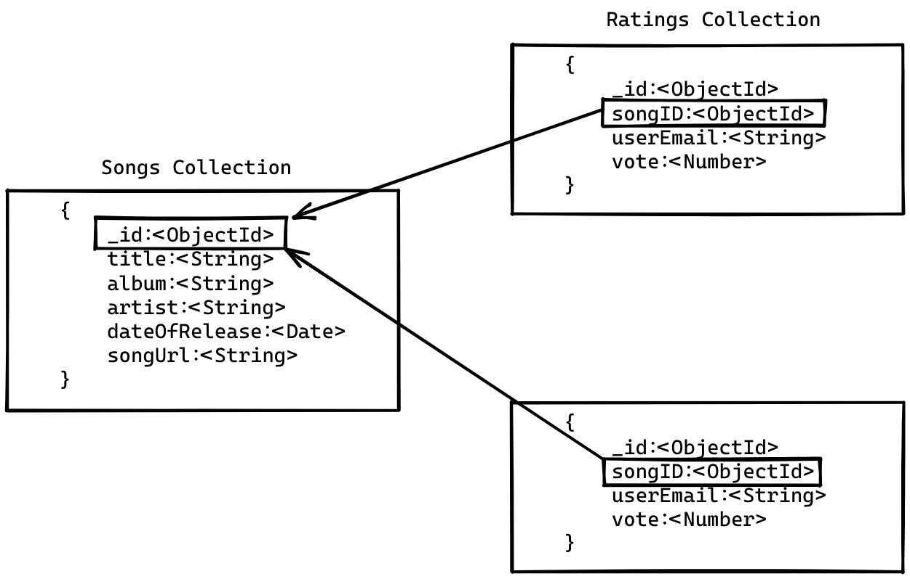

# Music Party API

## Project Description

A simple stateless microservice for a Music app. The Music app allows listeners to play any song of their choice from the playlist. The music app also has an admin interface that can add songs to the music app.

---

## How to setup on local environment

1. Install the required dependencies using the command `npm install`
2. Requires env variables `MONGODB_URI` which contains the URI of the mongoDB cluster, `JWT_SECRET_KEY` which contains an alphanumeric string to sign the JWT with
3. To start the application run `npm run dev` Application will be availaible at **http://localhost:8080/**

---

## Data Model

---

App is up and running on heroku : **https://music-party-aystic.herokuapp.com**

Check the API Documentation : **https://documenter.getpostman.com/view/21393025/2s8YmEy66G**

---
